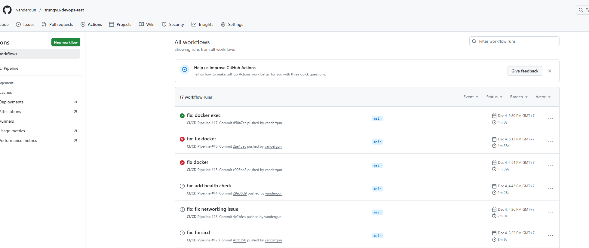
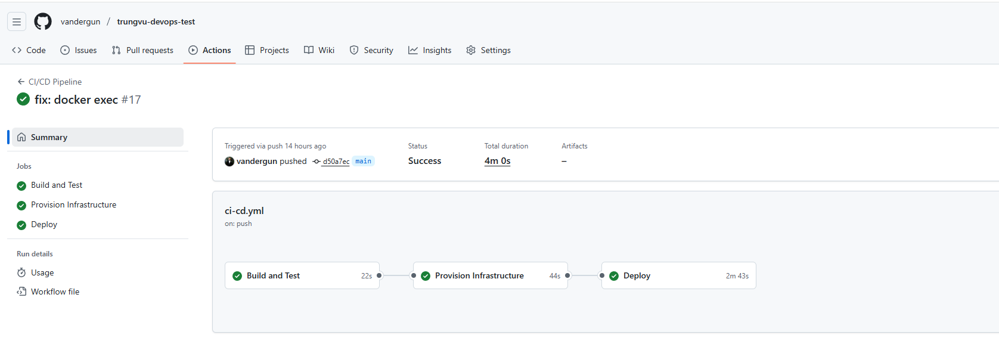
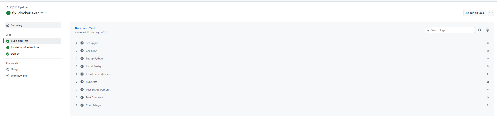
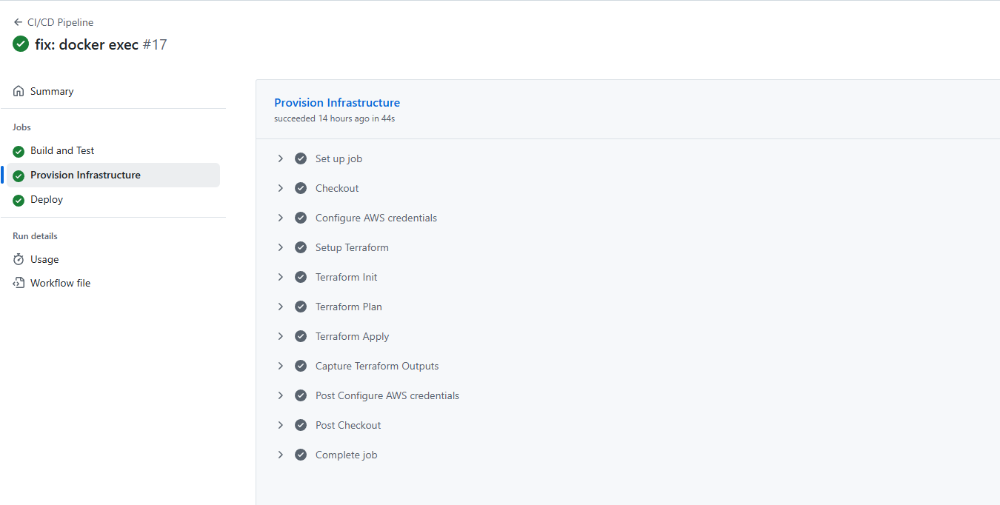
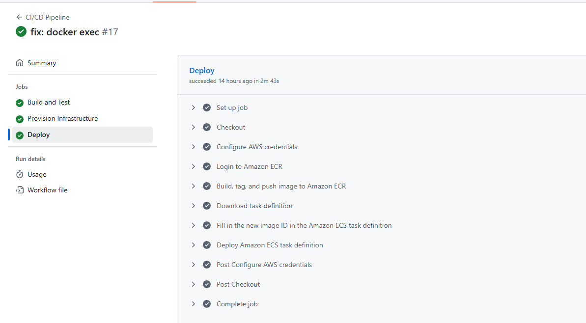
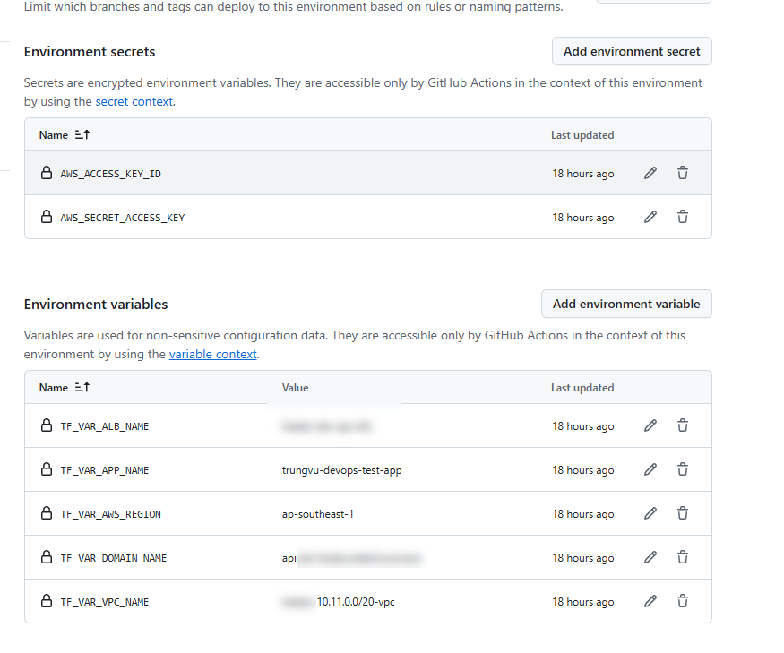
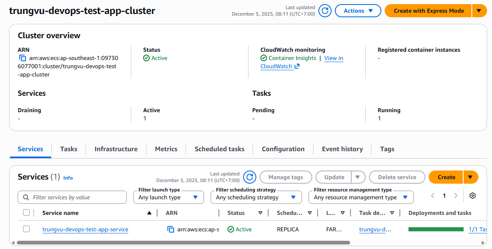
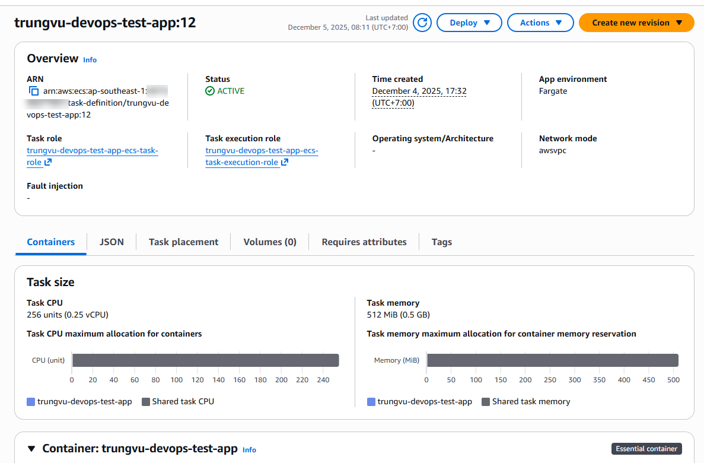
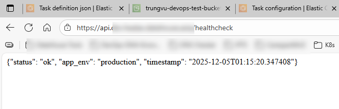

# trung-vu-devops-test — Deployment Approach & Guidelines

Goal

- Deploy a containerized app to AWS ECS (Fargate) using Terraform for infra and GitHub Actions for CI/CD.
- Keep infrastructure configurable via GitHub Variables and secrets; pipeline produces and consumes Terraform outputs (ECR, ECS names, task family).

Quick architecture

- ECR: Docker image registry (created by Terraform).
- ECS (Fargate): Runs tasks; service behind an ALB.
- ALB: Existing ALB routes external traffic to ECS.
- Terraform: Provisions ECR, ECS cluster/service, task definition, CloudWatch logs.
- GitHub Actions: build → provision → deploy pipeline.

Prerequisites

- AWS account with permissions for ECR, ECS, IAM, CloudWatch, S3 (state).
- S3 bucket for Terraform state (trungvu-devops-test-bucket).
- GitHub repository with Actions enabled.

GitHub Secrets

- AWS_ACCESS_KEY_ID
- AWS_SECRET_ACCESS_KEY

GitHub Variables (Actions → Variables)

- TF_VAR_VPC_NAME — existing VPC tag (required)
- TF_VAR_ALB_NAME — existing ALB name (required)
- TF_VAR_DOMAIN_NAME — domain for ALB/DNS (required)
- TF_VAR_AWS_REGION — region to deploy (default: us-east-1)
- TF_VAR_APP_NAME — application name (default: devops-test-app)
- TF_VAR_APP_PORT — container port (ensure matches Dockerfile / app)

Pipeline overview (what runs on push → main)

1. Build & Test
   - Install dependencies and run tests.
2. Terraform (Provision)
   - terraform init (S3 backend), plan, apply.
   - Outputs exported: ecr_repository_url, ecs_cluster_name, ecs_service_name, task_definition_family (and optionally task_definition_arn).
3. Deploy
   - Login to ECR (uses registry region derived from terraform output).
   - Build image, tag with SHA and latest, push to ECR.
   - Download task definition, replace image, register new task definition, update ECS service and wait for stability.

Implementation step

- Init Terraform backend S3 bucket and prepare the iac code in terraform folder
- When define the CICD, the ECR login must use the registry region. The workflow extracts region from the ECR URL before `aws ecr get-login-password`.
- When describing a task definition, use the task family or revision (not always the full ARN). The workflow uses retries to wait for the task definition to be available.
- Dockerfile lacks a CMD/ENTRYPOINT, set the container `command` in the task definition (e.g., ["poetry","run","python3","main.py"]) so ECS starts the service.
- Ensure container port in Terraform var.app_port matches Dockerfile EXPOSE and the application listens on that port.

Troubleshooting some issues during implement

- "no basic auth credentials" → ensure ECR login step succeeds (region and registry correct).
- "Essential container in task exited" → check CloudWatch task logs; Dockerfile lacks a CMD/ENTRYPOINT, set the container `command` in the task definition (e.g., ["poetry","run","python3","main.py"]) so ECS starts the service, environment variables, and that app listens on expected port.
- DescribeTaskDefinition errors → confirm task family exists; add retries or use task definition ARN/family from Terraform outputs.

## Result

